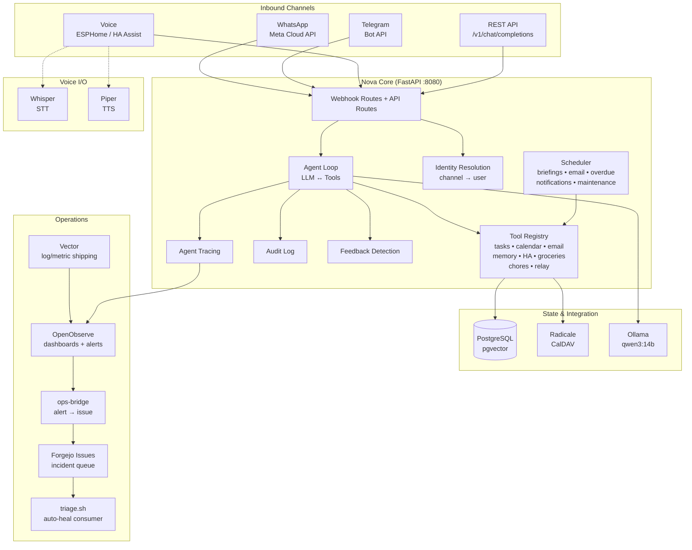

<!-- generated-by: gsd-doc-writer -->

# Architecture

## System overview

Nova is a private, self-hosted AI household assistant running on a local Proxmox server with an NVIDIA RTX PRO 2000 GPU (passed through to the nova-ai VM, used by Ollama and Whisper). It provides a shared household plan — tasks, calendar, and email triage — reachable over WhatsApp, Telegram, voice (ESPHome satellites + iPhone via Home Assistant Assist), and a LAN dashboard. The architecture follows a **channel-agnostic agent loop** pattern: every text or voice input funnels into a single FastAPI service (Nova Core) that runs the same LLM→tools reasoning loop, with channel adapters handling inbound/outbound transport differences.

All reasoning runs locally via Ollama (GPU-accelerated); no prompts or household data leave the server. Only the WhatsApp (Meta Cloud API) and Outlook (Microsoft Graph) channels reach the internet by their nature.

## Component diagram



## Data flow

A typical agent turn from a WhatsApp message to Nova's reply:

1. **Ingress** — The Meta Cloud API sends a webhook POST to `/webhooks/whatsapp`. Caddy (reverse proxy) forwards it to `nova-core:8080`.

2. **Signature verification** — `security.verify_whatsapp_signature()` validates the `X-Hub-Signature-256` header against the shared app secret.

3. **Identity resolution** — The sender's E.164 number is looked up in `user_preferences.whatsapp_number` → maps to a household user (Ruben, Méral, or household). `identity.user_from_whatsapp()` performs the DB lookup via the `user_preferences` table (WhatsApp number mapping), while `identity.user_from_telegram()` uses `channel_identities` for Telegram chat IDs.

4. **Channel adapter** — `channels/whatsapp.py`'s `process_incoming_whatsapp()` converts the WhatsApp message JSON into a text string, resolves the sender via `identity.user_from_whatsapp()`, then fans into `agent.run_agent()`.

5. **Agent loop** (`agent.py`):
   - Loads system prompt (includes user name, current time, relevant memories from `db.get_user_memories()`).
   - Calls `llm.chat(messages, tools=tool_specs())` → Ollama `/api/chat` with OpenAI-style function definitions.
   - If the LLM returns `tool_calls`, executes each tool via `tools.call_tool()` and feeds the result back as a `tool` role message.
   - Repeats up to `nova_max_iterations` (default 6) times, bounded by `nova_max_turn_timeout` (120 seconds).
   - Confirmation gating: destructive tools (`create_event`, `complete_task`, `ha_call_service`, `forget`) require explicit user confirmation on the next turn unless already confirmed.
   - On completion, emits an `AgentTrace` to OpenObserve and captures feedback context.

6. **Egress** — The reply text is returned through the WhatsApp adapter, which calls the Meta Cloud API to send the message back to the user.

For proactive pushes (briefings, reminders), the scheduler calls `channels/dispatcher.send_to_user()` which resolves the user's `last_active_channel` preference, gates via DND and calendar-busy checks, and routes through the appropriate channel adapter.

## Key abstractions

| Abstraction | File | Description |
|---|---|---|
| `Tool` (dataclass) | `services/nova-core/app/tools/base.py` | Decorator-registered async function exposed to the LLM as an OpenAI-style function definition. Validates arguments against JSON Schema. |
| `run_agent()` | `services/nova-core/app/agent.py` | The core agent loop: takes a user message + history, iterates LLM ↔ tool calls, returns final text reply. Channel-agnostic. |
| `chat()` | `services/nova-core/app/llm.py` | Thin async client for Ollama's `/api/chat` endpoint with tool-calling support, token counting, and exponential-backoff retry. |
| `Settings` (BaseSettings) | `services/nova-core/app/config.py` | Pydantic-based environment configuration loaded from `.env`. All runtime knobs (LLM model, DB creds, channel tokens, scheduler toggles). |
| `ChannelAdapter` (ABC) | `services/nova-core/app/channels/` | Abstract base for channel adapters (WhatsApp, Telegram), defining `send_message()` and `register_webhooks()` interfaces. |
| `send_to_user()` | `services/nova-core/app/channels/dispatcher.py` | Outbound message dispatcher: resolves last-active channel, applies DND/calendar gating, routes to the correct channel adapter. |
| `RoomSessionManager` | `services/nova-core/app/voice_rooms.py` | In-memory TTL session store for voice room identity: tracks which user is speaking in each room, falls back to DB defaults, then "household". |
| `AgentTrace` | `services/nova-core/app/tracer.py` | Structured trace dataclass emitted to OpenObserve after every agent turn (latency, tokens, tool calls, errors, stuck detection). |
| `record_tool_call()` | `services/nova-core/app/audit.py` | Writes mutating tool invocations to the `audit_log` table (user, tool, action summary, status, confirmation flag). |
| `file_feedback_issue()` | `services/nova-core/app/feedback.py` | Detects user-feedback patterns ("that was wrong") and files a structured, redacted Forgejo issue tagged `feedback`. |

## Directory structure rationale

```
nova/
├── Caddyfile                  # Reverse proxy: LAN dashboard + API (WhatsApp webhook tunneled)
├── docker-compose.yml         # Full stack definition (nova-core, postgres, ollama, whisper, piper, vector, ops-bridge, radicale, caddy)
├── docker-compose.staging.yml # Staging override for Coolify deployments
├── .env.example               # Canonical environment variable template
├── pyproject.toml             # Python project config (pytest, ruff, mypy settings)
├── services/
│   ├── nova-core/             # The FastAPI brain — the primary service
│   │   ├── app/
│   │   │   ├── main.py        # FastAPI entrypoint: routes, lifespan, scheduler init
│   │   │   ├── agent.py       # LLM ↔ tools agent loop
│   │   │   ├── llm.py         # Ollama chat client with tool calling
│   │   │   ├── config.py      # Pydantic Settings — all env-driven config
│   │   │   ├── models.py      # OpenAI-compatible request/response Pydantic schemas
│   │   │   ├── db.py          # asyncpg pool, Alembic migrations, user-memory queries
│   │   │   ├── identity.py    # Channel identity → household user resolution
│   │   │   ├── security.py    # Webhook signature verification (HMAC)
│   │   │   ├── scheduler.py   # Background jobs: briefings, email, overdue tasks, maintenance
│   │   │   ├── tracer.py      # Structured agent-turn traces → OpenObserve
│   │   │   ├── audit.py       # Audit log writer for mutating tool calls
│   │   │   ├── feedback.py    # User-feedback detection + Forgejo issue filing
│   │   │   ├── voice_rooms.py # In-memory voice room session tracking
│   │   │   ├── vision.py      # Vision model (llava) integration
│   │   │   ├── forgejo.py     # Forgejo API client for issue management
│   │   │   ├── tools/         # Household capabilities (tasks, calendar, email, memory, etc.)
│   │   │   ├── channels/      # Channel adapters (WhatsApp, Telegram) + dispatcher + webhook router
│   │   │   └── maintenance/   # Scheduled maintenance agents (dep scan, log anomaly, backup verify, trend report)
│   │   ├── alembic/           # Database migrations (Alembic)
│   │   ├── static/            # Dashboard static assets (Phase 8)
│   │   └── tests/             # Pytest test suite
│   └── ops-bridge/            # OpenObserve alert webhook → Forgejo issue bridge
│       ├── app.py             # FastAPI receiver: alert fingerprinting, dedup, issue creation
│       └── tests/             # Pytest test suite
├── infra/
│   ├── postgres/init/         # First-boot SQL schema directory (schema managed via Alembic; contains only an archive/ subdirectory)
│   └── vector/vector.yaml     # Vector config: container logs + host metrics → OpenObserve
├── ops/                       # Closed-loop incident management tooling
│   ├── triage.sh              # Polls open auto-heal issues, runs heal.sh autonomously
│   ├── heal.sh                # Claude Code headless: diagnose + fix + commit
│   ├── deploy.sh              # Coolify deployment trigger
│   ├── observe.sh             # Post-deploy verification → Forgejo issues on failure
│   ├── issue.sh               # Forgejo issue API CLI
│   ├── pipeline.sh            # Full deploy → observe → triage loop
│   ├── promote.sh             # Staging → production promotion
│   ├── run-tests.sh           # Test runner for CI
│   ├── lib.sh                 # Shared bash library
│   ├── config.env.example     # Template for ops script configuration
│   ├── provision/             # Proxmox host provisioning scripts (Phase 0)
│   ├── secrets/               # Gitignored secrets directory
│   └── incidents/             # Local Claude Code transcripts + diagnosis files
└── docs/                      # Project documentation
    └── roadmap.md             # Build phases and extension tracks
```

**Rationale:**

- **`services/nova-core/` is a self-contained FastAPI app** — it has its own `Dockerfile`, `requirements.txt`, `alembic.ini`, tests, and static assets. This keeps the deployment unit clean and makes it portable across environments.
- **`app/tools/` and `app/channels/` are separate subpackages** because they represent orthogonal concerns. Tools are household capabilities (data side); channels are transport adapters (I/O side). Adding a new channel or tool only touches its own module.
- **`ops/` is shell scripts, not a service** — the healing agent runs as a systemd timer on the ops host, not inside a container. Scripts are self-contained with a shared `lib.sh` for common functions.
- **`infra/` holds configuration, not code** — Postgres init SQL and Vector YAML config are infrastructure concerns that rarely change and are read-only in containers.
- **`ops-bridge/` is a separate service** because it runs on a different port (8085), has its own auth (`X-Bridge-Token`), and its lifecycle is independent of Nova Core (it bridges OpenObserve to Forgejo, not user requests).
